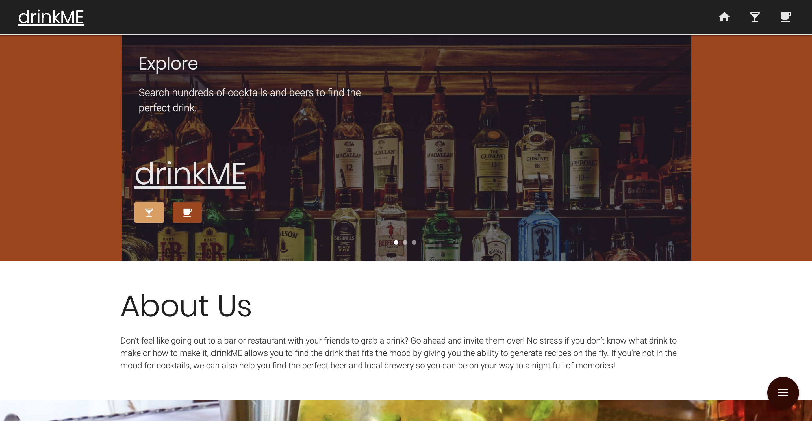
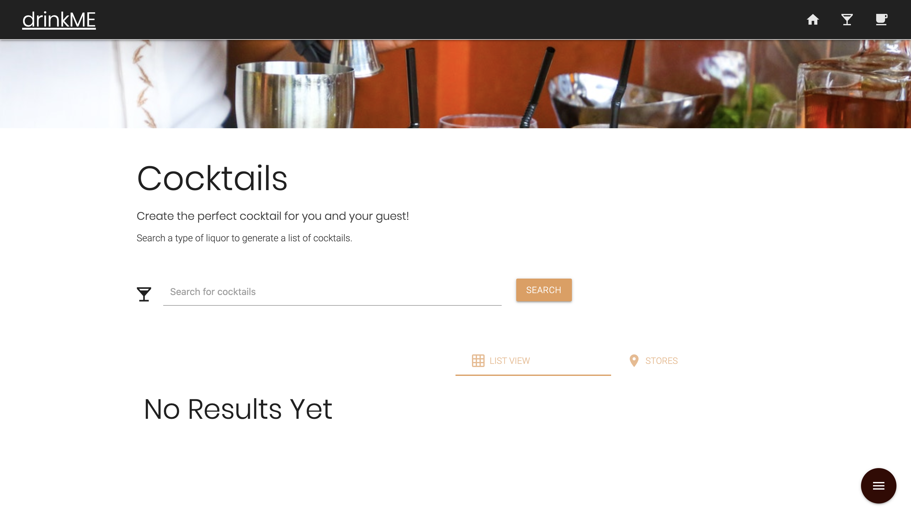
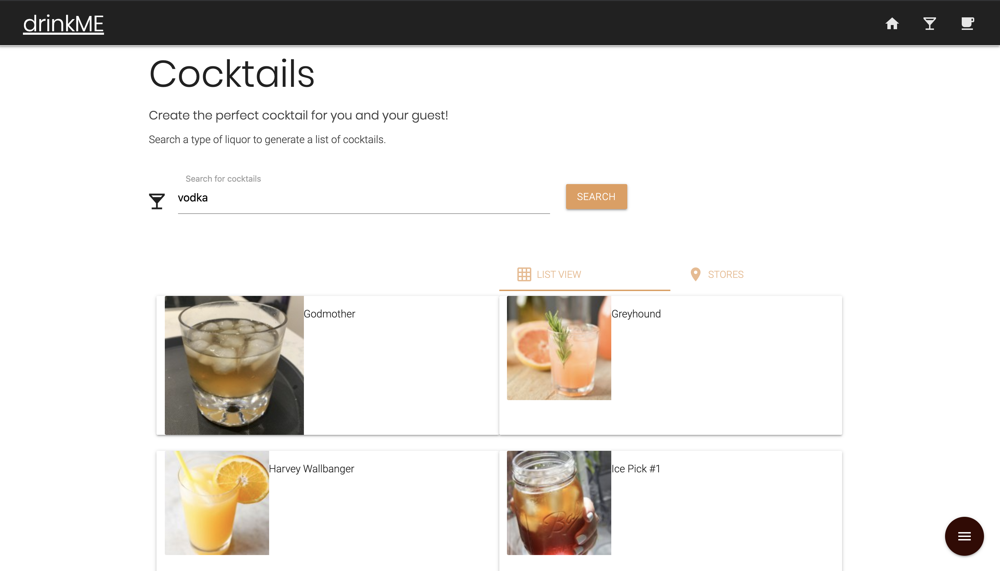
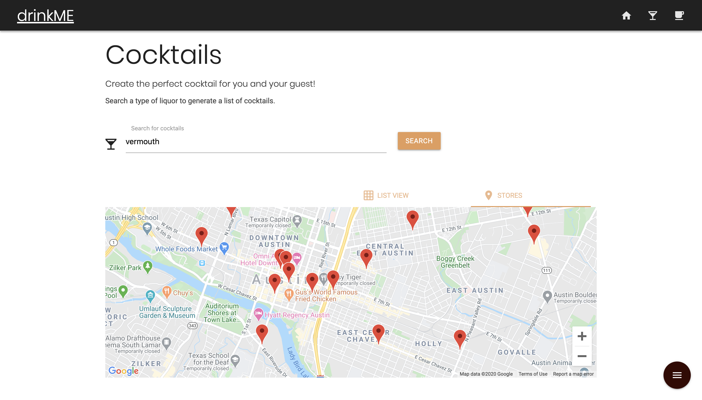
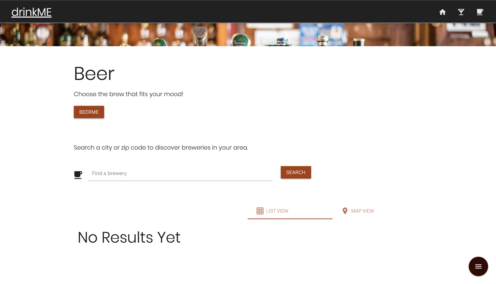
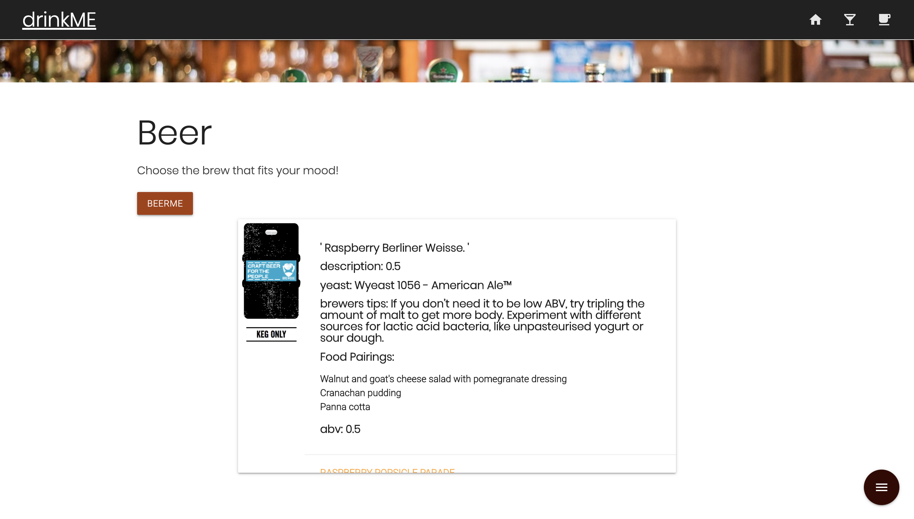
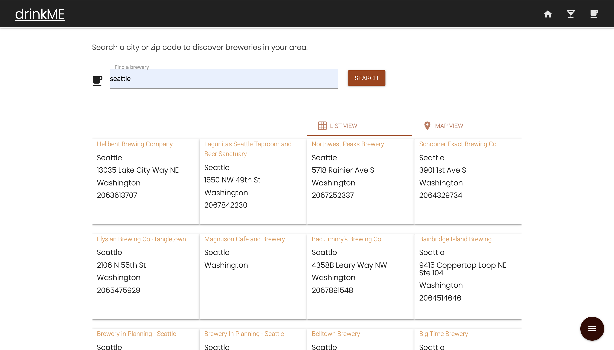
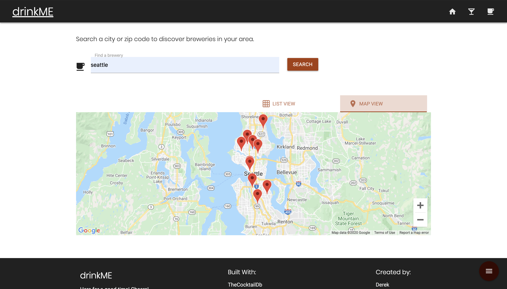

# drinkME
 
Don’t feel like going out to a bar or restaurant with your friends to grab a drink? Go ahead and invite them over! No stress if you don’t know what drink to make or how to make it, drinkME allows you to find the drink that fits the mood by giving you the ability to generate recipes on the fly. If you're not in the mood for cocktails, we can also help you find the perfect beer and local brewery so you can be on your way to a night full of memories!

This application uses four APIs; Google , Punk, Open Brewery, and CocktailDB. For style, we used Materialize.

## Images of Completed Website 

### Step 1

### Step 2

### Step 3

### Step 4

### Step 5

### Step 6

### Step 7

### Step 8

### Step 9

## Link to Site

Deployed website [drinkMe] ()

## Contributing
Pull requests are welcome. For major changes, please open an issue first to discuss what you would like to change.

Please make sure to update tests as appropriate.

## License
[2020](https://choosealicense.com/licenses/mit/)