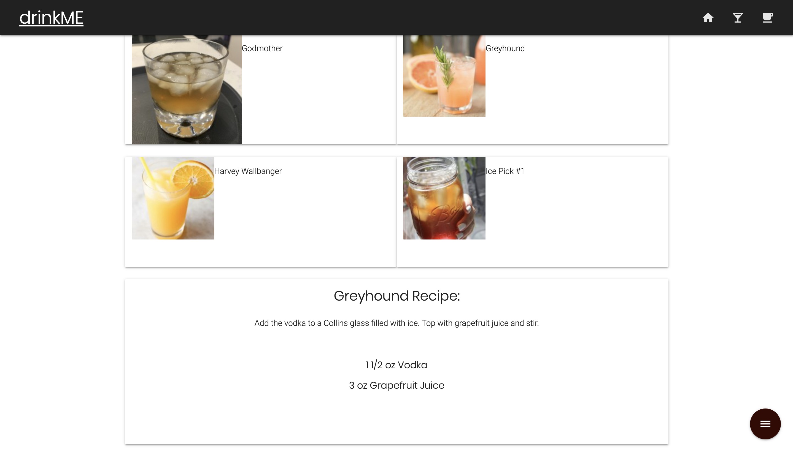

# drinkME
 
 #### About Us
Don’t feel like going out to a bar or restaurant with your friends to grab a drink? Go ahead and invite them over! No stress if you don’t know what drink to make or how to make it, drinkME allows you to find the drink that fits the mood by giving you the ability to generate recipes on the fly. If you're not in the mood for cocktails, we can also help you find the perfect beer and local brewery so you can be on your way to a night full of memories!

#### APIs
This application uses four APIs; Google , Punk, Open Brewery, and CocktailDB. For style, we used Materialize.

#### Nav
We have three methods of quick navigation around the page. The first is the nav bar, the second are the floating buttons in the corner, and the third is the drinkME title in the top left corner. 

#### CocktailDB API
The cocktail section allows the user to search for multiple random drinks made from a type of alcohol, then gives the recipe and ingredients when the drink tile is clicked. 

#### Beer APIs
The beer section uses PUNK API to generate a random beer for the user. Then, the user can use the input field to find a brewery near them to enjoy their beer. We used the google maps API and Open brewery API to allow the user to find a brewery near them by zip code or city to enjoy their beer. 

## Images of Completed Website 

### Step 1

### Step 2

### Step 3

### Step 4

### Step 5

### Step 6

### Step 7

### Step 8

### Step 9

## Link to Site

Deployed website [drinkMe](https://derek-watson14.github.io/drinkME/)

## Contributing
Pull requests are welcome. For major changes, please open an issue first to discuss what you would like to change.

Please make sure to update tests as appropriate.

## License
[2020](https://choosealicense.com/licenses/mit/)